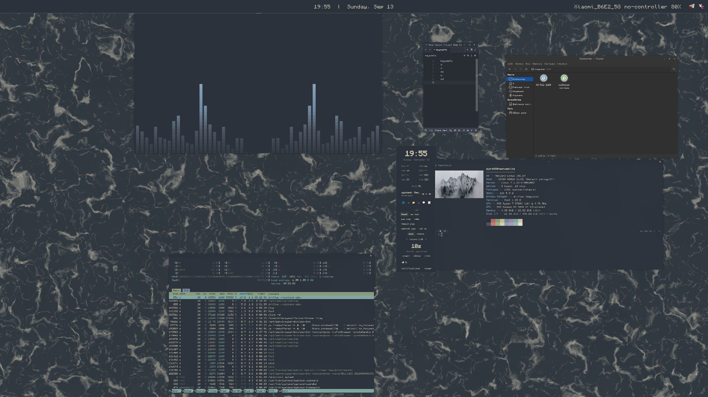

<p align="center">
  
</p>


# dotfiles — dark_sea

A driftwm rice built around `dark_sea.glsl` (dark teal water, warm cream
foam) — carried through the compositor decorations, the quickshell home
dashboard, waybar, terminals, the launcher, notifications, the lock screen,
GTK/KDE, the shell prompt, and Zed.

## Install

```sh
bash -c "git clone https://github.com/DenisPth/dotfiles.git ~/dotfiles && cd ~/dotfiles && ./install.sh"
```

or the long way:

```sh
git clone https://github.com/DenisPth/dotfiles.git ~/dotfiles
cd ~/dotfiles
./install.sh
```

Supports **Arch/Manjaro** (needs [`yay`](https://github.com/Jguer/yay) —
driftwm and a couple of other pieces only exist on the AUR) and **Fedora**
(driftwm is built from source, a few packages come from COPR — see the
notes `install.sh` prints at the end). The script installs every package
these configs expect, symlinks the configs from this repo into `~/.config`
and `~` (existing files are backed up, timestamped, rather than
overwritten), and asks once whether you want `sddm` or `ly` (themed
dark_sea) set up as your login manager. Edit the live config afterward and
you're editing this repo.

## What's here

- **driftwm** — compositor config, the quickshell home dashboard (clock,
  weather, battery/network/brightness/cpu/kbd/bluetooth/volume/ram/disk
  tiles, media player, app launcher, tea timer, pomodoro, notes, tray),
  a drill-down GNOME-Settings-shaped window (`mod+s`: wi-fi, bluetooth,
  sound, brightness & power, display resolution, wallpaper, clock format,
  weather location, keyboard layouts, about, dotfiles/system updates,
  keybinds reference), scripts (spotlight search, clipboard picker, battery
  notifications, screen recording).
- **waybar** — a `custom/window` module reads driftwm's own IPC
  (`driftwm msg subscribe`) for the focused window title, since driftwm has
  no Hyprland/Sway-style workspaces to hook a stock module into.
- **ghostty** (primary) **/ kitty** — Monocraft, dark_sea 16-color palette.
- **fuzzel** — launcher + `mod+v` clipboard picker (cliphist), Papirus-Dark
  icons.
- **swaync**, **swaylock**, **cava**, **btop**, **kanshi**, **GTK 3/4**,
  **kdeglobals/kcminputrc** (Bibata-Modern-Classic cursor, Papirus-Dark
  icons), **fastfetch**, **Zed** ("Dark Sea" theme).
- **.zshrc / .p10k.zsh** — Oh My Zsh (fetched by `install.sh`, not vendored
  in this repo) + Powerlevel10k, autosuggestions and syntax highlighting
  from system packages, ~18 OMZ plugins (git, sudo, extract, fzf, zoxide,
  eza with icons in the dark_sea palette, …), dark_sea colors throughout.

## Font

[Monocraft](https://github.com/IdreesInc/Monocraft) (Nerd Font patched) — a
monospace font styled after old Minecraft's pixel font. Not packaged;
`install.sh` fetches it from the upstream release.
